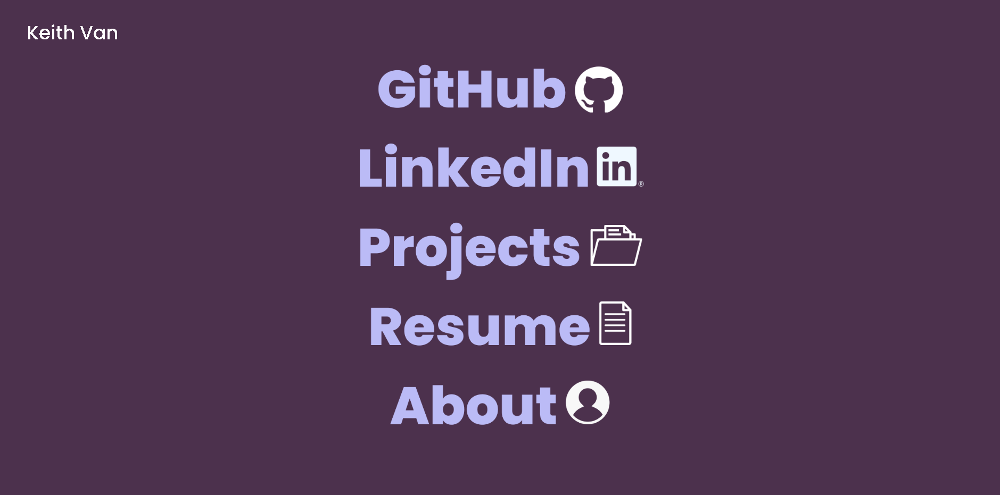

 

  <h3 align="center">NVious7's Portfolio</h3>

  

    Learn about me!
     
     
    <a href="https://nvious7-portfolio.netlify.app/"><strong>View Live Site »</strong></a>
     
     
    <a href="https://github.com/NVious7/Portfolio">Explore the docs</a>
    .
    <a href="https://github.com/NVious7/Portfolio/issues">Report Bug</a>
    .
    <a href="https://github.com/NVious7/Portfolio/issues">Request Feature</a>
  

## About The Project

The journey started in a Discord call with Pierce DeAnda, Andy Fernandez, and Jaden Monroe. We were playing with tools like Penpot and Figma in which I made the homepage of mine as a joke, but then the color palette and minimalistic design with an offset title grew on me and I stuck to it.

Important takeaways would be responsive design, user experience, and the friends we made along the journey.

## Built With

* React
* HTML
* CSS
* SASS
* JavaScript
* React Router
* Framer Motion
